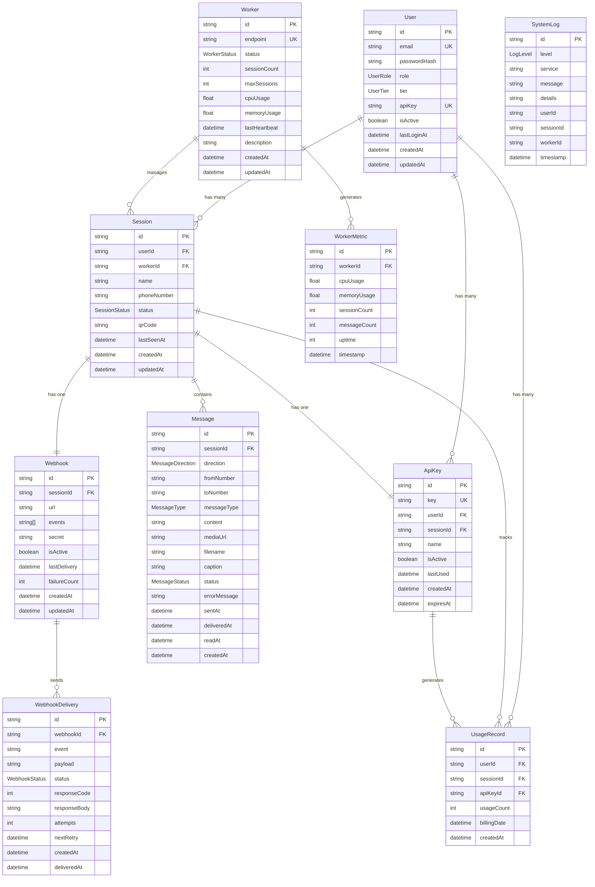

# WhatsApp Gateway PaaS - Database ERD

## Entity Relationship Diagram



## Key Relationships Explained

### 🔐 User Management

- **User** → **Session**: One user can have multiple WhatsApp sessions
- **User** → **ApiKey**: One user can have multiple API keys (global + per session)
- **User** → **UsageRecord**: Track all API usage per user

### 📱 Session Management

- **Session** → **Worker**: Each session is assigned to one worker
- **Session** → **Message**: Each session contains multiple messages
- **Session** → **ApiKey**: Each session has exactly one API key
- **Session** → **Webhook**: Each session has exactly one webhook
- **Session** → **UsageRecord**: Track usage per session

### 🖥️ Worker Management

- **Worker** → **Session**: One worker manages multiple sessions
- **Worker** → **WorkerMetric**: Workers generate performance metrics

### 📊 Usage Tracking

- **UsageRecord** tracks API hits from:
  - **User**: Which user made the API call
  - **Session**: Which session was used (optional)
  - **ApiKey**: Which API key was used

### 🔔 Webhook System

- **Session** → **Webhook**: Each session has its own webhook configuration
- **Webhook** → **WebhookDelivery**: Track delivery attempts for each webhook

## Database Indexes

### Performance Optimization

```sql
-- Usage tracking indexes
CREATE INDEX idx_usage_user_billing ON usage_records(user_id, billing_date);
CREATE INDEX idx_usage_apikey_billing ON usage_records(api_key_id, billing_date);
CREATE INDEX idx_usage_session_billing ON usage_records(session_id, billing_date);

-- Session management indexes
CREATE INDEX idx_session_user ON sessions(user_id);
CREATE INDEX idx_session_worker ON sessions(worker_id);
CREATE INDEX idx_session_status ON sessions(status);

-- API key indexes
CREATE INDEX idx_apikey_user ON api_keys(user_id);
CREATE INDEX idx_apikey_session ON api_keys(session_id);
CREATE INDEX idx_apikey_active ON api_keys(is_active);

-- Message indexes
CREATE INDEX idx_message_session ON messages(session_id);
CREATE INDEX idx_message_created ON messages(created_at);

-- Worker metrics indexes
CREATE INDEX idx_worker_metrics_worker ON worker_metrics(worker_id);
CREATE INDEX idx_worker_metrics_timestamp ON worker_metrics(timestamp);
```

## Usage Scenarios

### 1. API Usage Tracking Flow

```
1. User makes API call with API key
2. System validates API key
3. System creates UsageRecord entry:
   - userId: from API key
   - sessionId: from API key (if session-specific)
   - apiKeyId: the API key used
   - usageCount: 1
   - billingDate: current month (YYYY-MM-01)
```

### 2. Billing Query Example

```sql
-- Get monthly usage for a user
SELECT
    u.email,
    u.tier,
    SUM(ur.usage_count) as total_api_calls,
    ur.billing_date
FROM users u
JOIN usage_records ur ON u.id = ur.user_id
WHERE ur.billing_date = '2025-01-01'
GROUP BY u.id, ur.billing_date;
```

### 3. Rate Limiting Check

```sql
-- Check current hour usage for rate limiting
SELECT SUM(usage_count) as current_usage
FROM usage_records
WHERE api_key_id = ?
AND created_at >= NOW() - INTERVAL '1 hour';
```

## Tier Limits Reference

| Tier  | Sessions | API Calls/Hour | Monthly Price |
| ----- | -------- | -------------- | ------------- |
| BASIC | 1        | 100            | Free          |
| PRO   | 5        | 1,000          | $29           |
| MAX   | 20       | 10,000         | $99           |

## Data Flow Summary

1. **User Registration** → Creates User record with API key
2. **Session Creation** → Creates Session + assigns Worker + generates session API key
3. **API Calls** → Creates UsageRecord entries for billing/analytics
4. **Message Sending** → Creates Message records for history
5. **Worker Monitoring** → Creates WorkerMetric records for performance
6. **Webhook Events** → Creates WebhookDelivery records for tracking
